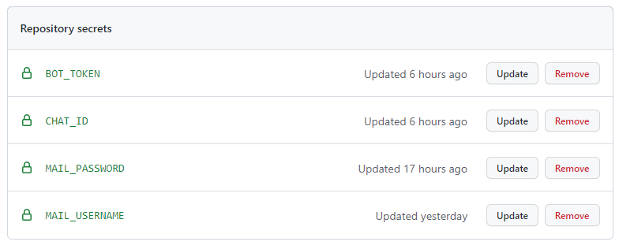
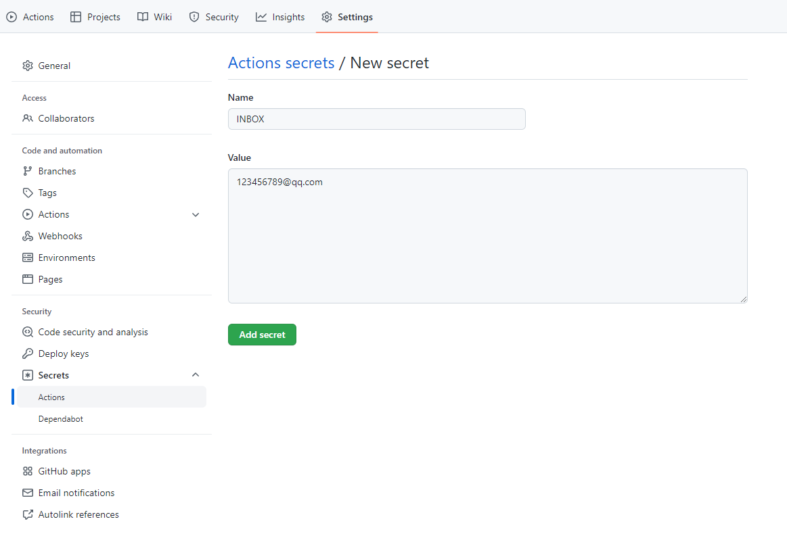
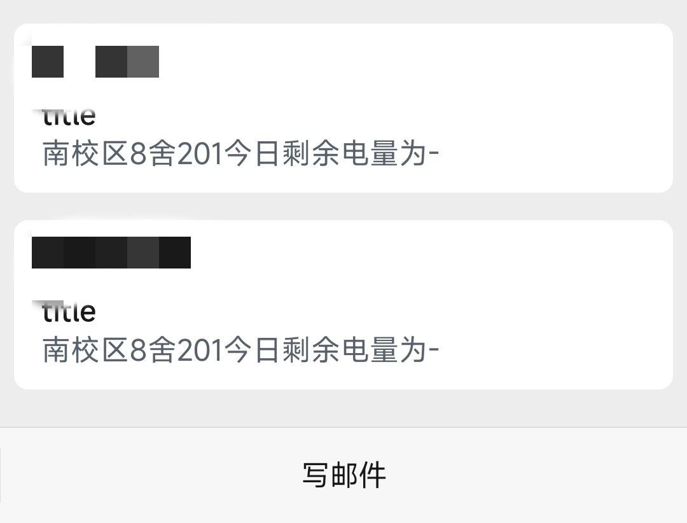
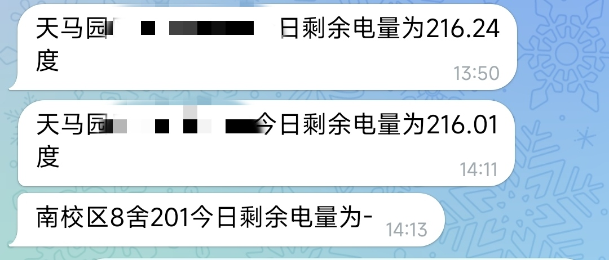

# HNU电费自动查询
有天晚上打着打着机忽然断电所以写了这个，很丑且没有技术含量

# 使用方法
1. fork本项目
2. 修改.config中信息
3. 在Settings的Secrets的action的右上角添加参数(自行谷歌一下):
   - telegrambot: Name填BOT_TOKEN , Value为你的telegrambot api Name填CHAT_ID , Value为你的chatid
   - email: Name填MAIL_USERNAME , Vaule为你的邮箱 Name填MAIL_PASSWORD , Value为你的邮箱smtp授权码 Name填INBOX , Value为收件邮箱地址(好像能和发件箱一致) (默认qq邮箱，其他邮箱自行修改smtpmail.sh中smtp地址)
   - 在加了喵
 示例:  
4. Actions添加workflows并运行(定时11点,自己在.github/workflow/config.yml按utc+0改,虽然github的时间不太准,估计会晚个1h+) 记得看眼输出的信息对不对，错了不背锅喵
5. 输出样例  
# To do
各种发送方式(等一个大佬pr
 别急睡了喵
